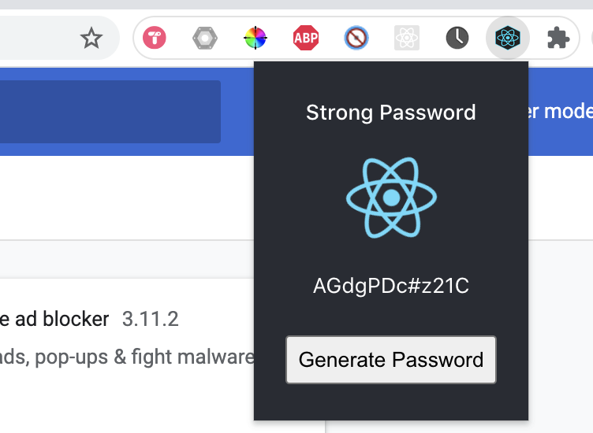

# chrome-strong-password

Chrome Extension built with React which creates strong password.

[Watch this Video](https://www.loom.com/share/7cea85019b8e4a899a26ea3096c16a97)

[Tutorial](https://medium.com/litslink/how-to-create-google-chrome-extension-using-react-js-5c9e343323ff)


## Getting Started

```shell
yarn install
```

```shell
yarn start
```

1. In your chrome browser type: `chrome://extensions/`

2. Load unpacked from the `./dev` directory


Click the icon to show the popup

Click the button to generate a new password

