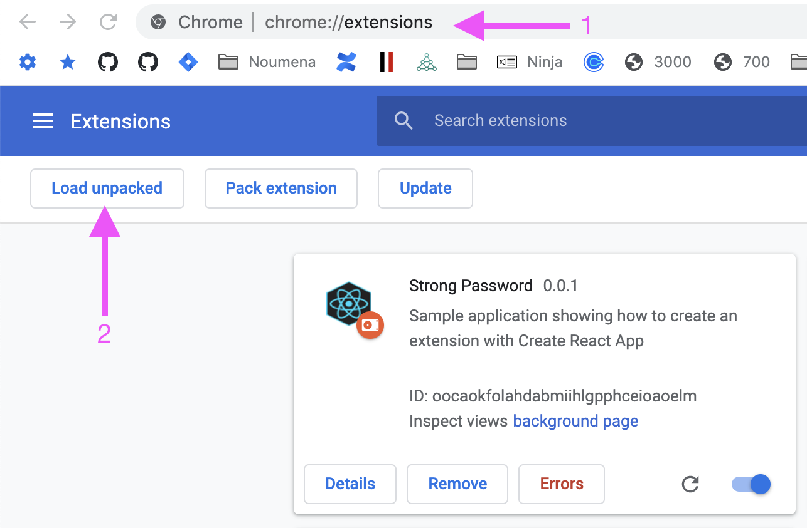

# chrome-strong-password

```shell
yarn install
```

```shell
yarn start
```

1. In your chrome browser type: `chrome://extensions/`

2. Load unpacked from the `./dev` directory



Click the icon to show the popup

Click the button to generate a new password

